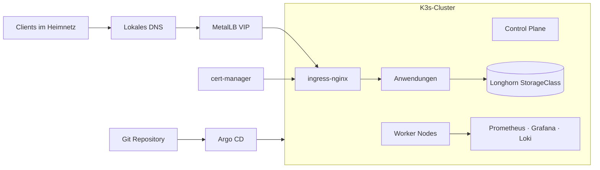

# Homelab K3s Cluster

Dieses Repository beschreibt einen privaten, mit Argo CD verwalteten K3s-Cluster. Der gewünschte Clusterzustand liegt in Git; Argo CD gleicht ihn automatisch mit dem laufenden Cluster ab.

## Architektur auf einen Blick



Die ausführliche [Architektur- und Clusterübersicht](docs/architecture.md) beschreibt Control Plane und Worker, Netzwerk, TLS, Storage sowie den Argo-CD-GitOps-Flow.

## Repository-Struktur

| Pfad | Zweck |
| --- | --- |
| `bootstrap/` | Root Application als Einstiegspunkt für das App-of-Apps-Muster |
| `apps/production/` | Argo-CD-Applications und produktive Ressourcen |
| `infrastructure/` | Clusternahe Konfiguration, Dashboards und Betriebsressourcen |
| `examples/` | Manuell aktivierbare, reproduzierbare Beispiel-Deployments |
| `scripts/` | Administrative Hilfsskripte |

## Betrieb und Sicherheit

- [Monitoring, Backup und Restore](docs/operations.md)
- [Sicherheitsprinzipien](docs/security.md)
- [Cluster-Härtung und Troubleshooting](CLUSTER_HARDENING.md)
- [Beispiel-Deployment](examples/hello-app/README.md)

## GitOps-Workflow

1. Änderung auf einem Branch vornehmen und lokal validieren.
2. Pull Request prüfen und nach `main` mergen.
3. Argo CD erkennt den neuen Git-Stand und synchronisiert ihn automatisch.
4. Status in Argo CD und Auswirkungen in Grafana kontrollieren.

Direkte Änderungen mit `kubectl edit` sind nur zur Diagnose gedacht. Durch `selfHeal: true` überschreibt Argo CD Abweichungen wieder mit dem in Git definierten Zustand.

## Voraussetzungen

- ein laufender K3s-Cluster mit Argo CD
- eine von den Nodes erreichbare MetalLB-Adressrange
- lokales DNS für `*.homelab.local`
- die StorageClass `longhorn` (die Longhorn-Installation selbst wird aktuell nicht von diesem Repository verwaltet)
- lokal bereitgestellte oder versiegelte Secrets gemäß [Sicherheitsdokumentation](docs/security.md)

Bootstrap des Root-App-of-Apps:

```bash
kubectl apply -f bootstrap/root-app.yaml
```
