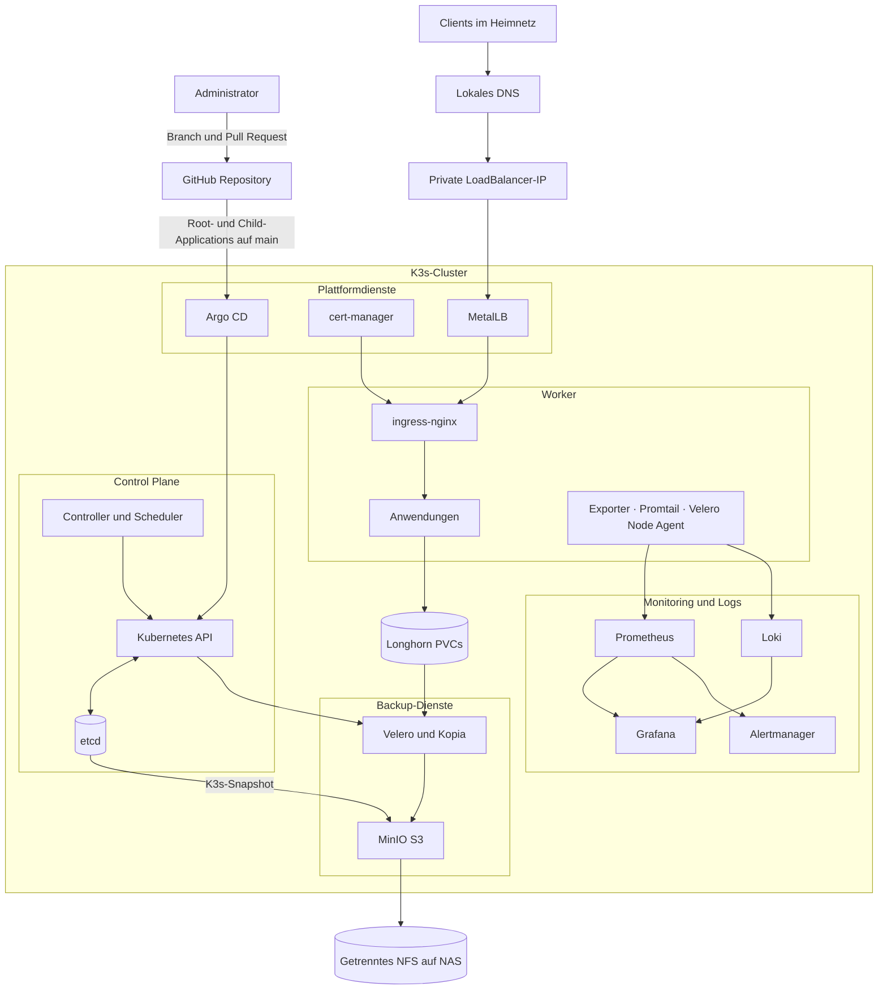
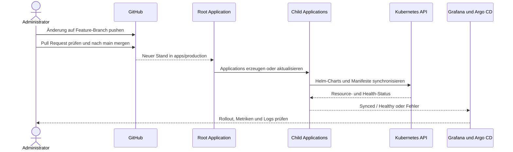
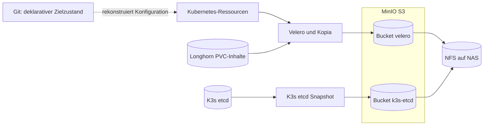

# Homelab K3s Cluster

Dieses Repository beschreibt den deklarativen Zielzustand eines privaten K3s-Clusters. Argo CD liest die Konfiguration aus Git und gleicht sie automatisch mit dem Cluster ab. Anwendungen werden ausschließlich über das lokale Netz veröffentlicht; persistente Daten liegen auf Longhorn, Backups getrennt davon auf einem NFS-Ziel.

## Zielbild

- Git ist die maßgebliche Quelle für Kubernetes- und Anwendungskonfiguration.
- Control Plane und Worker bilden gemeinsam den K3s-Cluster; ihre Bereitstellung selbst liegt außerhalb dieses Repositories.
- MetalLB und ingress-nginx stellen Dienste nur im Heimnetz bereit.
- cert-manager verwaltet Zertifikate, ohne private Schlüssel im Klartext in Git abzulegen.
- Prometheus, Grafana und Loki liefern Metriken, Dashboards, Alarme und Logs.
- Velero/Kopia und separate etcd-Snapshots sichern Workloads und Clusterzustand auf ein NFS-gestütztes MinIO-Ziel.

## Architektur



Das Diagramm zeigt logische Rollen. Anzahl, Betriebssystem und Provisionierung der Nodes werden nicht durch dieses Repository festgelegt. Die ausführliche Einordnung steht in der [Architektur- und Clusterübersicht](docs/architecture.md).

### Request- und Datenfluss

1. Ein Client löst einen Namen unter `*.homelab.local` über das lokale DNS auf.
2. Die private LoadBalancer-IP wird von MetalLB im Heimnetz angekündigt.
3. ingress-nginx terminiert TLS und routet anhand des Hostnamens zum internen `ClusterIP`-Service.
4. Die Anwendung liest oder schreibt persistente Daten über die StorageClass `longhorn`.
5. Exporter und Promtail senden Telemetrie an Prometheus beziehungsweise Loki; Grafana visualisiert beide Quellen.

Es gibt bewusst keinen DNS-Eintrag, Port-Forward und keine Ingress-Veröffentlichung aus dem öffentlichen Netz.

## Cluster-Komponenten

| Bereich | Komponente | Aufgabe | Verwaltung |
| --- | --- | --- | --- |
| Orchestrierung | K3s Control Plane | Kubernetes API, Scheduler, Controller und etcd | außerhalb des Repositories provisioniert |
| Compute | K3s Worker | führt Anwendungen und nodegebundene Agents aus | außerhalb des Repositories provisioniert |
| GitOps | Argo CD | synchronisiert Root-App und Child-Applications mit `prune` und `selfHeal` | Bootstrap über `bootstrap/root-app.yaml` |
| Netzwerk | MetalLB | vergibt private LoadBalancer-Adressen im LAN | `apps/production/metallb.yaml` und `infrastructure/metallb/` |
| Ingress | ingress-nginx | TLS-Terminierung und hostbasiertes Routing | `apps/production/ingress-nginx.yaml` |
| Zertifikate | cert-manager | verwaltet Issuer und Zertifikatsressourcen | `apps/production/cert-manager*.yaml` und `infrastructure/cert-manager/` |
| Secrets | Sealed Secrets | hält verschlüsselte Secret-Ressourcen Git-tauglich | `apps/production/sealed-secrets.yaml` |
| Primärspeicher | Longhorn | replizierter persistenter Speicher für Workload-PVCs | Installation extern, StorageClass wird vorausgesetzt |
| Metriken | Prometheus und Alertmanager | sammelt Metriken und wertet Alarmregeln aus | `apps/production/kube-prometheus-stack.yaml` |
| Visualisierung | Grafana | Dashboards für Metriken und Logs | Helm-Werte und `infrastructure/monitoring/` |
| Logs | Loki und Promtail | zentrale Logablage und Logsammlung auf Nodes | `apps/production/loki-stack.yaml` |
| Workload-Backup | Velero, Kopia und Node Agent | sichert Kubernetes-Ressourcen und PVC-Inhalte dateibasiert | `apps/production/velero.yaml` |
| Backup-Ablage | MinIO auf NFS | stellt getrennte S3-Buckets auf dem NAS bereit | `infrastructure/velero/` |

Prometheus bewahrt Metriken derzeit 14 Tage beziehungsweise bis 18 GB auf einem 20-GiB-Longhorn-PVC auf. Loki nutzt ebenfalls Longhorn und eine Aufbewahrung von 30 Tagen. Grafana bindet beide Datenquellen ein; Alertmanager übernimmt die Alarmverarbeitung. Weitere Details und Prüfkommandos enthält die [Betriebsdokumentation](docs/operations.md).

## Argo-CD-GitOps-Flow



Die Root Application beobachtet `apps/production/`. Jede dort definierte Child-Application verweist entweder auf einen Helm-Chart oder auf einen Pfad dieses Repositories. Automatisches `prune` entfernt nicht mehr deklarierte Ressourcen, `selfHeal` korrigiert Abweichungen im Cluster.

Der normale Änderungsweg ist:

1. Branch erstellen und Manifeste lokal rendern beziehungsweise validieren.
2. Änderung als Pull Request prüfen lassen.
3. Nach `main` mergen.
4. Argo-CD-Synchronisierung und Health-Status kontrollieren.
5. Auswirkungen in Grafana, Prometheus und Loki beobachten.

Direkte Änderungen mit `kubectl edit` sind nur für Diagnose und Notfälle gedacht. Dauerhafte Korrekturen gehören nach Git, da Argo CD manuelle Abweichungen andernfalls zurücksetzt.

## Backup- und Restore-Prinzip

Konfiguration, Laufzeitdaten und Clusterzustand werden auf unterschiedlichen Ebenen behandelt:



| Sicherungsebene | Zeitplan | Aufbewahrung | Inhalt |
| --- | --- | --- | --- |
| Git | bei jedem Merge | Git-Historie | deklarative Konfiguration, keine Klartext-Secrets und keine Laufzeitdaten |
| Velero täglich | täglich 02:00 Uhr | 30 Tage | Cluster-Ressourcen und PVC-Dateien per Kopia; System- und Velero-Namespaces sind ausgeschlossen |
| Velero wöchentlich | sonntags 03:00 Uhr | 90 Tage | vollständige zusätzliche Workload-Sicherung nach denselben Regeln |
| K3s etcd | jeden zweiten Tag 03:00 Uhr | 14 Snapshots | Control-Plane-Zustand im separaten Bucket `k3s-etcd` |

Longhorn ist der Primärspeicher; das MinIO-Backend liegt auf einem separaten NFS-Pfad des NAS. Der statische NFS-PV verwendet die Reclaim Policy `Retain`, damit das Löschen eines Kubernetes-Claims nicht automatisch die Sicherungsdaten löscht. Das ist eine Trennung von Primär- und Backup-Speicher, aber kein vollständiger Ersatz für eine zusätzliche Offline- oder Offsite-Kopie.

### Restore-Reihenfolge

1. K3s-Control-Plane und Nodes wiederherstellen oder neu bereitstellen.
2. Bei Verlust des gesamten Clusterzustands das passende etcd-Snapshot nach dem K3s-Verfahren einspielen.
3. Argo CD installieren und `bootstrap/root-app.yaml` anwenden.
4. Warten, bis Infrastruktur, MinIO und Velero synchron und gesund sind.
5. Gewünschtes Velero-Backup prüfen und einen Restore zunächst mit begrenztem Namespace-Umfang testen.
6. Anwendungen, PVC-Daten, Ingress und DNS-Auflösung kontrollieren.
7. Erst nach erfolgreicher Prüfung produktiven Traffic wieder zulassen.

Ein Backup gilt erst dann als belastbar, wenn ein Restore regelmäßig getestet wurde. Rohdaten außerhalb von Kubernetes-PVCs sowie das NFS-Ziel selbst benötigen eine separate NAS-/Offsite-Strategie. Konkrete Befehle und Prüfungen stehen unter [Monitoring, Backup und Restore](docs/operations.md) sowie in der [Velero-Dokumentation dieses Repositories](infrastructure/velero/README.md).

## Sicherheit

- Workloads werden nur über lokale `*.homelab.local`-Ingresses veröffentlicht.
- Secrets erscheinen weder im README noch in Beispielen im Klartext; produktive Werte werden lokal erzeugt oder als Sealed Secrets versioniert.
- Das Beispiel-Deployment demonstriert Pod-Security-Regeln, restriktive Security Contexts und eine NetworkPolicy als Vorlage für weitere Workloads.
- TLS-Schlüssel und lokale CA-Daten bleiben außerhalb von Git.
- Zugangsdaten in Logs, Ausgaben und Dokumentation müssen vor dem Commit redigiert werden.

Weitere Vorgaben beschreibt [docs/security.md](docs/security.md); Hinweise zur Cluster-Härtung stehen in [CLUSTER_HARDENING.md](CLUSTER_HARDENING.md).

## Repository-Struktur

| Pfad | Zweck |
| --- | --- |
| `bootstrap/` | Root Application als Einstiegspunkt für das App-of-Apps-Muster |
| `apps/production/` | Argo-CD-Applications für Infrastruktur und produktive Anwendungen |
| `infrastructure/` | repositoryeigene Manifeste, Dashboards, Regeln und Backup-Ressourcen |
| `examples/` | manuell aktivierbare, reproduzierbare Beispiel-Deployments |
| `docs/` | Architektur-, Betriebs- und Sicherheitsdokumentation |
| `scripts/` | administrative Hilfsskripte |

## Voraussetzungen

- ein laufender K3s-Cluster mit erreichbarer Kubernetes API
- installiertes Argo CD mit Leserechten auf dieses Repository
- eine freie, von allen Nodes erreichbare MetalLB-Adressrange
- lokales DNS für `*.homelab.local`
- die StorageClass `longhorn`; die Longhorn-Installation selbst wird nicht von diesem Repository verwaltet
- ein von den Nodes beschreibbarer NFS-Export für das Backup-Ziel
- lokal bereitgestellte oder versiegelte Secrets gemäß [Sicherheitsdokumentation](docs/security.md)
- ein TLS-Secret beziehungsweise Zertifikatsprozess für die lokalen Ingress-Namespaces

Wenn MetalLB allein für `LoadBalancer`-Services zuständig sein soll, sollte der integrierte K3s ServiceLB deaktiviert sein, um konkurrierende Implementierungen zu vermeiden.

## Bootstrap und Kontrolle

Nach dem Bereitstellen aller externen Voraussetzungen und Secrets wird nur die Root Application manuell angewendet:

```bash
kubectl apply -f bootstrap/root-app.yaml
kubectl get applications --namespace argocd
kubectl get nodes
kubectl get ingress --all-namespaces
```

Für den Clusterstatus sollten die Argo-CD-Applications anschließend `Synced` und `Healthy`, alle Nodes `Ready` und die Backup Storage Location `Available` melden.

## Reproduzierbares Beispiel-Deployment

`examples/hello-app/` demonstriert den vollständigen Weg von Git über Argo CD bis zu einem lokalen HTTPS-Endpunkt. Das Beispiel enthält zwei Replikas, Probes, Ressourcenlimits, einen gehärteten Security Context, NetworkPolicy und PodDisruptionBudget.

```bash
kubectl kustomize examples/hello-app/manifests
kubectl apply --dry-run=client -k examples/hello-app/manifests
kubectl apply -f examples/hello-app/argocd-application.yaml
```

Voraussetzungen, Health-Prüfung und Entfernung sind in der [README des Beispiels](examples/hello-app/README.md) dokumentiert.

## Weiterführende Dokumentation

- [Architektur- und Clusterübersicht](docs/architecture.md)
- [Monitoring, Backup und Restore](docs/operations.md)
- [Sicherheitsprinzipien](docs/security.md)
- [Cluster-Härtung und Troubleshooting](CLUSTER_HARDENING.md)
- [Zertifikate im lokalen Netz](infrastructure/certs/README.md)
