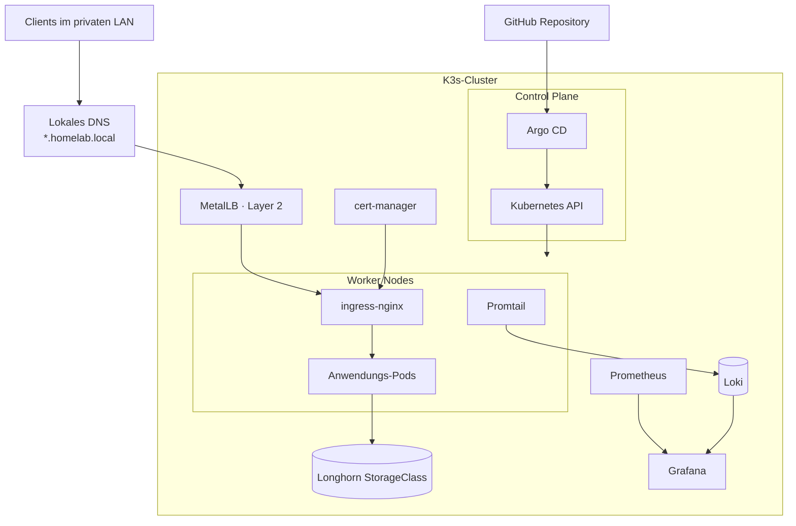
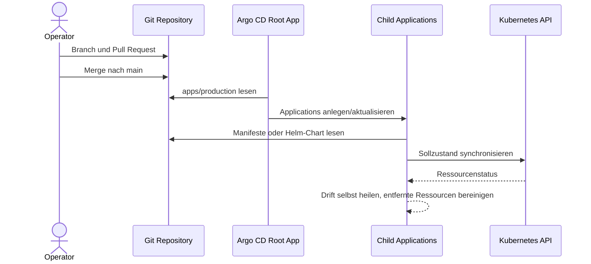

# Architektur und Clusterübersicht

## Zielbild

Der Cluster trennt deklarative Konfiguration, Laufzeit und persistente Daten. Git ist die Quelle der Wahrheit, Argo CD übernimmt den Abgleich, und K3s führt die Workloads auf Control-Plane- und Worker-Nodes aus.

Das Diagramm zeigt die logischen Rollen. Die konkrete Anzahl und Zuordnung der Nodes wird nicht in diesem Repository provisioniert und ist deshalb bewusst nicht fest codiert.

## Komponenten

| Bereich | Komponente | Aufgabe | Konfiguration |
| --- | --- | --- | --- |
| Orchestrierung | K3s Control Plane | API, Scheduling und Clusterzustand | außerhalb dieses Repositories |
| Compute | K3s Worker | Ausführung von Pods und DaemonSets | außerhalb dieses Repositories |
| GitOps | Argo CD | kontinuierlicher Soll-/Ist-Abgleich | `bootstrap/root-app.yaml` |
| Load Balancing | MetalLB | private LoadBalancer-IP per Layer 2 | `apps/production/metallb.yaml` |
| Ingress | ingress-nginx | HTTP(S)-Routing zu Services | `apps/production/ingress-nginx.yaml` |
| TLS | cert-manager | Ausstellung und Erneuerung von Zertifikaten | `apps/production/cert-manager*.yaml` |
| Storage | Longhorn | persistente Volumes über die StorageClass `longhorn` | als Cluster-Voraussetzung |
| Metriken | Prometheus | Scraping, Regeln und Aufbewahrung | `apps/production/kube-prometheus-stack.yaml` |
| Visualisierung | Grafana | Dashboards für Metriken und Logs | `apps/production/kube-prometheus-stack.yaml` |
| Logs | Promtail und Loki | Einsammeln und Speichern von Pod-Logs | `apps/production/loki-stack.yaml` |
| Backup | Velero und MinIO | Ressourcen- und Volume-Backups auf NFS | `apps/production/velero.yaml` |

## Netzwerk- und Request-Flow

1. Ein Client im Heimnetz löst einen lokalen Hostnamen auf.
2. Das lokale DNS liefert eine IP aus dem MetalLB-Pool.
3. MetalLB kündigt die IP im Layer-2-Netz an und leitet zum `LoadBalancer`-Service von ingress-nginx.
4. ingress-nginx terminiert TLS und routet anhand des Hostnamens zum internen `ClusterIP`-Service.
5. cert-manager verwaltet die vom Ingress referenzierten TLS-Secrets.

MetalLB stellt Erreichbarkeit im lokalen Netz her, öffnet aber selbst keine Firewall- oder Router-Ports. Die Netzwerkgrenze ist in [Sicherheitsprinzipien](security.md) beschrieben.

## Argo-CD-GitOps-Flow

`bootstrap/root-app.yaml` beobachtet `apps/production`. Die dort definierten Child Applications beziehen entweder Manifeste aus diesem Repository oder versionierte Helm-Charts. Automatisches Pruning und Self-Healing sorgen dafür, dass der Cluster wieder auf den Git-Stand zurückkehrt.

## Storage-Grenze

Workloads referenzieren `storageClassName: longhorn`. Dieses Repository installiert Longhorn derzeit nicht; eine funktionsfähige Longhorn-Installation ist daher eine explizite Voraussetzung. Velero sichert Kubernetes-Ressourcen und Volume-Inhalte auf ein separates, über MinIO angebundenes NFS-Ziel. Diese Trennung verhindert, dass Primärdaten und Backups ausschließlich im selben Storage-System liegen.
