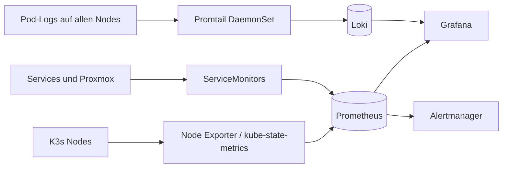
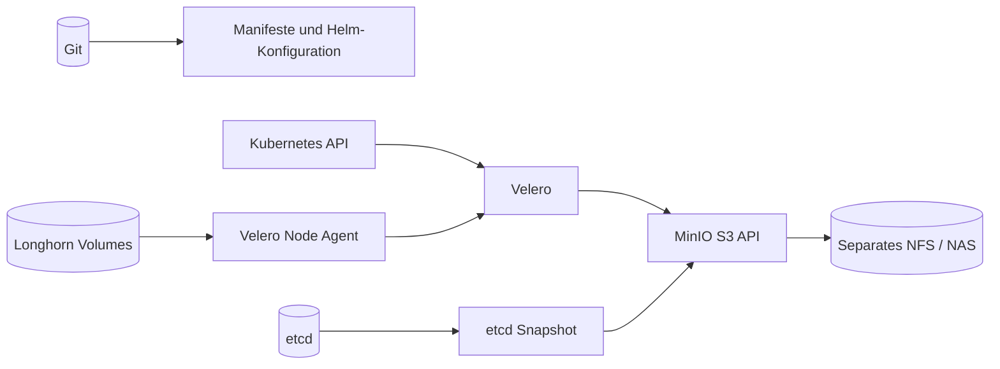

# Betrieb: Monitoring, Backup und Restore

## Monitoring-Stack



| Komponente | Zweck | Persistenz |
| --- | --- | --- |
| Prometheus | Metriken, Recording Rules und Alerts | 20 GiB Longhorn, 14 Tage beziehungsweise 18 GB |
| Grafana | Dashboards und gemeinsamer Zugriff auf Metriken und Logs | 2 GiB Longhorn |
| Loki | zentrale Log-Ablage | 20 GiB Longhorn, derzeit 30 Tage konfiguriert |
| Promtail | Log-Agent als DaemonSet auf den Nodes | keine eigene Persistenz |
| Alertmanager | Gruppierung und Routing von Alerts | 1 GiB Longhorn |

Die zentralen Definitionen liegen in `apps/production/kube-prometheus-stack.yaml`, `apps/production/loki-stack.yaml` und `infrastructure/monitoring/`. Grafana-Dashboards und Prometheus-Regeln sind versioniert und werden durch Argo CD verteilt.

### Tägliche Prüfung

```bash
kubectl get applications -n argocd
kubectl get pods -n monitoring
kubectl get prometheusrules -n monitoring
kubectl get pvc -n monitoring
```

In Grafana sollten mindestens Clusterzustand, Nodes, Pods, Proxmox und Loki-Logs geprüft werden. `CLUSTER_HARDENING.md` enthält ergänzende PromQL-Abfragen und Recovery-Hinweise.

## Backup-Prinzip

Backups folgen dem 3-2-1-Gedanken soweit im Homelab praktikabel:

1. Der deklarative Sollzustand liegt in Git.
2. Velero sichert Kubernetes-Ressourcen und persistente Volume-Inhalte.
3. MinIO schreibt die Backups auf ein separates NFS-Ziel außerhalb des K3s-Storage.
4. Ein etcd-Snapshot dient als zusätzliche Sicherung des Clusterzustands.



Im Repository existieren tägliche und wöchentliche Velero-Schedules sowie ein zusätzliches Manifest für ein Cluster-Backup. Für die effektiv laufenden Zeitpläne ist immer der Zustand im Cluster maßgeblich:

```bash
kubectl get schedules.velero.io -n velero
kubectl get backups.velero.io -n velero --sort-by=.metadata.creationTimestamp
kubectl get backupstoragelocations.velero.io -n velero
```

Ein vorhandenes Backup ist erst dann belastbar, wenn ein Restore getestet wurde. Mindestens quartalsweise sollte ein isolierter Test-Restore erfolgen; das Ergebnis wird außerhalb des Clusters protokolliert. NFS-Daten, die nicht als Kubernetes-Volume eingebunden sind, brauchen eine separate Sicherungsstrategie.

## Restore-Prinzip

Die Wiederherstellung erfolgt schichtweise, damit GitOps nicht gegen noch unvollständige Daten- oder Secret-Restores arbeitet:

1. K3s und die benötigten Nodes wiederherstellen oder neu installieren.
2. Longhorn und weitere externe Cluster-Voraussetzungen bereitstellen.
3. Namespaces und erforderliche Secrets aus einer sicheren Quelle wiederherstellen.
4. Velero und Zugriff auf das Backup-Ziel bereitstellen.
5. Den gewünschten Velero-Backupstand in einen isolierten oder leeren Zielcluster restaurieren.
6. Argo CD bootstrappen und den Git-Sollzustand synchronisieren lassen.
7. PVCs, Deployments, Ingress, Zertifikate und Anwendungsdaten validieren.
8. Erst danach DNS beziehungsweise Benutzerzugriff freigeben.

Beispiel für einen kontrollierten Namespace-Restore:

```bash
velero backup describe BACKUP_NAME --details
velero restore create RESTORE_NAME \
  --from-backup BACKUP_NAME \
  --include-namespaces NAMESPACE
velero restore describe RESTORE_NAME --details
velero restore logs RESTORE_NAME
```

Vor einem vollständigen etcd-Restore muss Argo CD gestoppt oder der automatische Sync kontrolliert werden. Ein etcd-Snapshot ist versionssensitiv und wird nur mit einer kompatiblen K3s-Version restauriert. Die konkreten Velero-Kommandos und Storage-Details stehen in `infrastructure/velero/README.md`.

## Erfolgskriterien eines Restore-Tests

- der Restore endet ohne Fehler und Warnungen sind bewertet
- alle erwarteten PVCs sind `Bound`
- Deployments erreichen ihre gewünschte Replikazahl
- Ingress ist ausschließlich über das private Netz erreichbar
- eine Stichprobe persistenter Anwendungsdaten ist lesbar
- Prometheus scrapt den restaurierten Workload und Loki erhält dessen Logs
- das tatsächliche RPO und RTO werden dokumentiert
